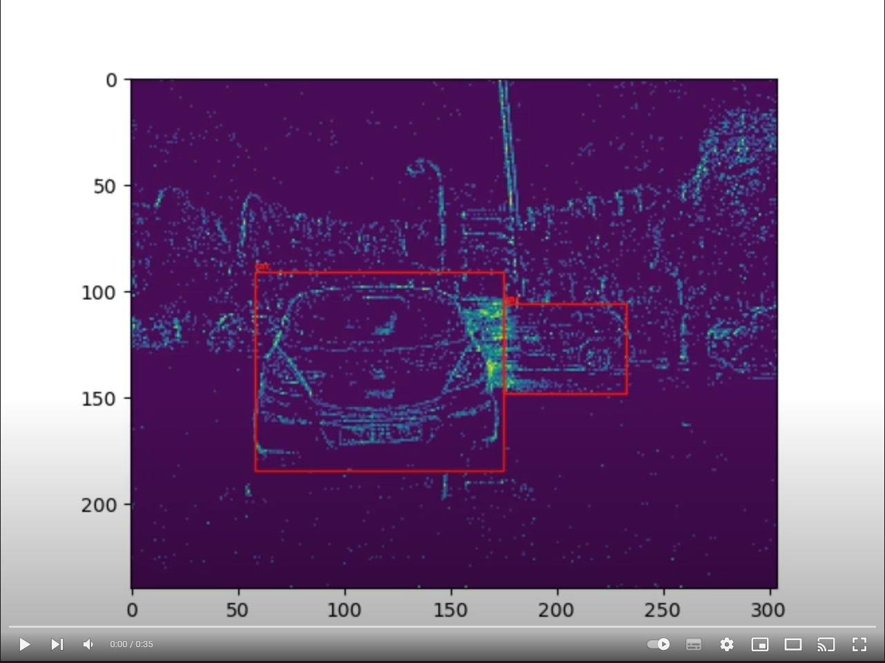

# Object Detection with Spiking Neural Networks on Automotive Event Data

*This work is supported by the French technological research agency (ANRT) through a CIFRE thesis in collaboration between Renault and Université Côte d'Azur.*

This repository contains the codes for the paper [Object Detection with Spiking Neural Networks on Automotive Event Data](https://arxiv.org/abs/2205.04339), accepted to the IJCNN 2022, presenting the first SNNs capable of doing object detection on the complex [Prophesee GEN1 event dataset](https://www.prophesee.ai/2020/01/24/prophesee-gen1-automotive-detection-dataset/).

Our main contributions are:
1. We present a novel approach to encode event data called *voxel cube* that preserves their binarity and temporal information while keeping a low number of timesteps. (see the `datasets` module)
2. We propose a new challenging dataset for classification on automotive event data: GEN1 Automotive Classification, generated using the Prophesee object detection dataset of the same name. (see `datasets/classification_datasets.py`)
3. We train four different spiking neural networks for classification tasks based on popular neural network architectures (SqueezeNet, VGG, MobileNet, DenseNet) and evaluate them on two automotive event datasets, setting new state-of-the-art results for spiking neural networks. (see the `models` module)
4. We present spiking neural networks for object detection composed of a spiking backbone and SSD bounding box regression heads that achieve qualitative results on the real-world GEN1 Automotive Detection event dataset. (see `object_detection_module.py`)
 
Our codes require [SpikingJelly 0.0.0.0.4](https://github.com/fangwei123456/spikingjelly/tree/0.0.0.0.4), PyTorch 1.11.0, Torchvision 0.11.1, PyTorch Lightning 1.4.4 and Torchmetrics 0.5.0.

# Results
Since the publication of the paper, results have been improved by correcting errors in the dataset generation and using more epochs for classification tasks (30 epochs instead of 10).

## Object Detection on Prophesee GEN1

| **Models** | **#Params** | **ACCs/ts** | **COCO mAP &#8593;** | **Sparsity &#8595;** |
|---|:---:|:---:|:---:|:---:|
| VGG-11 + SSD | 12.64M | 11.07G | 0.174 | 22.22% |
| MobileNet-64 + SSD | 24.26M | 4.34G | 0.147 | 29.44% |
| DenseNet121-24 + SSD | 8.2M | 2.33G | 0.189 | 37.20% |

Train a VGG-11 + SSD model on Prophesee GEN1 with 5 timesteps and 2 tbins:

    python object_detection.py -path path/to/GEN1_dataset -backbone vgg-11 -T 5 -tbin 2 -save_ckpt

To measure test mAP and sparsity on a pretrained model:

    python object_detection.py -path path/to/GEN1_dataset -backbone vgg-11 -T 5 -tbin 2 -pretrained path/to/pretrained_model -no_train -test

Other parameters are available in `object_detection.py`.

## Classification on Prophesee NCARS and Prophesee GEN1 Classification datasets

| **Models** | **#Params** | **ACCs/ts** | **NCARS acc &#8593;** | **NCARS sparsity &#8595;** | **GEN1 Classif acc &#8593;** | **GEN1 Classif sparsity &#8595;** |
|---|:---:|:---:|:---:|:---:|:---:|:---:|
| SqueezeNet 1.0 | 0.74M | 0.05G | 0.731 | 31.26% | 0.627 | 6.65% |
| SqueezeNet 1.1 | 0.72M | 0.02G | 0.846 | 25.13% | 0.674 | 6.79% |
| VGG-11 | 9.23M | 0.61G | 0.924 | 12.04% | 0.969 | 14.69% |
| VGG-13 | 9.41M | 0.92G | 0.910 | 14.53% | 0.970 | 19.03% |
| VGG-16 | 14.72M | 1.26G | 0.905 | 14.91% | 0.977 | 18.79% |
| MobileNet-16 | 1.18M | 0.27G | 0.842 | 17.57% | 0.949 | 15.15% |
| MobileNet-32 | 7.41M | 1.06G | 0.902 | 18.53% | 0.955 | 14.37% |
| MobileNet-64 | 18.81M | 4.20G | 0.917 | 17.14% | 0.966 | 30.60% |
| DenseNet121-16 | 1.76M | 1.01G | 0.889 | 27.99% | 0.970 | 20.31% |
| DenseNet169-16 | 3.16M | 1.19G | 0.893 | 30.12% | 0.969 | 23.12% |
| DenseNet121-24 | 3.93M | 2.25G | 0.904 | 33.59% | 0.975 | 27.26% |
| DenseNet169-24 | 7.05M | 2.66G | 0.879 | 34.02% | 0.962 | 28.29% |
| DenseNet121-32 | 6.95M | 3.98G | 0.898 | 38.32% | 0.966 | 29.46% |
| DenseNet169-32 | 12.48 | 4.72G | 0.825 | 37.48% | 0.967 | 40.35% |

Train a DenseNet121-16 on Prophesee NCARS with 5 timesteps and 2 tbins:

    python classification.py -dataset ncars -path path/to/NCARS_dataset -model densenet121-16 -T 5 -tbin 2

To measure test accuracy and sparsity on a pretrained model:

    python object_detection.py -dataset ncars -path path/to/NCARS_dataset -model densenet121-16 -T 5 -tbin 2 -pretrained path/to/pretrained_model -no_train -test

Other parameters are available in `classification.py`.

# Citation

If you find this work useful feel free to cite our IJCNN paper:

    L. Cordone, B. Miramond and P. Thierion, "Object Detection with Spiking Neural Networks on Automotive Event Data", International Joint Conference on Neural Networks, 2022.

 

    @InProceedings{Cordone_2022_IJCNN,
        author    = {Cordone, Loic and Miramond, Benoît and Thierion, Phillipe},
        title     = {Object Detection with Spiking Neural Networks on Automotive Event Data},
        booktitle = {Proceedings of the IEEE International Joint Conference on Neural Networks (IJCNN)},
        month     = {July},
        year      = {2022},
        pages     = {}
    }

